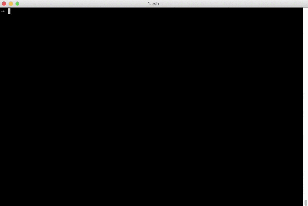

# Minishell

*As beautiful as a shell*



## About
Through the Minishell project, you will get to the core of the Unix system and explore
an important part of this system’s API: process creation and synchronisation. Executing
a command inside a shell implies creating a new process, which execution and final state
will be monitored by its parent’s process.

## Installation
1. Download/Clone this repo
```
git clone https://github.com/pankratdodo/minishell-42.git
```
2. `cd` into directrory and run `make`
```
make
./minishell
```
## Main project instructions
#### General Instructions
- Project must be written in C in accordance with [the Norm](https://github.com/R4meau/minishell/blob/master/norme.en.pdf).
- Program cannot have memory leaks.
- No Segmentation fault, bus error, double free, etc.
- This interpreter must display a prompt (a simple `$> ` for example) and wait till you type a command line, validated by pressing enter.
- The prompt is shown again only once the command has been completely executed.
- The executable are those you can find in the paths indicated in the `PATH` variable.
- In cases where the executable cannot be found, it has to show an error message and
display the prompt again.
- You must implement a series of builtins: `echo`, `cd`, `setenv`, `unsetenv`, `env`, `exit`.
- Allowed to use the following functions:
  - *malloc, free*
  - *access*
  - *open, close, read, write*
  - *opendir, readdir, closedir*
  - *getcwd, chdir*
  - *stat, lstat, fstat*
  - *fork, execve*
  - *wait, waitpid, wait3, wait4*
  - *signal, kill*
  - *exit*
#### Bonus Part
- Management of signals and in particular Ctrl-C. The use of global variables is
allowed as part of this bonus.
- Auto completion.
- The separation of commands with ";".
- Functions `help`, `clear`.
